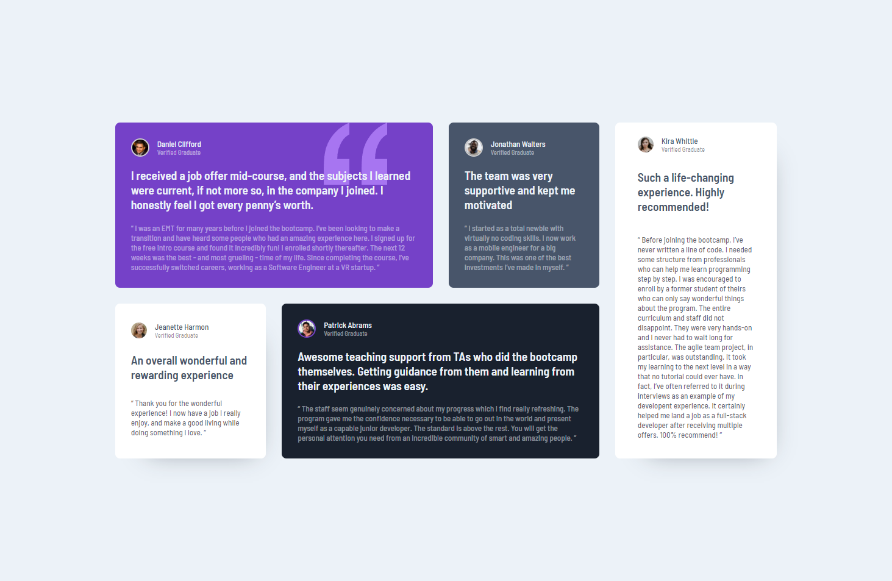

# Frontend Mentor - Testimonials grid section solution

This is a solution to the [Testimonials grid section challenge on Frontend Mentor](https://www.frontendmentor.io/challenges/testimonials-grid-section-Nnw6J7Un7). Frontend Mentor challenges help you improve your coding skills by building realistic projects.

## Table of contents

- [Overview](#overview)
  - [The challenge](#the-challenge)
  - [Screenshot](#screenshot)
  - [Links](#links)
- [My process](#my-process)
  - [Built with](#built-with)
  - [What I learned](#what-i-learned)
- [Author](#author)

## Overview

Building a responsive testimonials grid section.

### The challenge

Users should be able to:

- View the optimal layout for the site depending on their device's screen size

### Screenshot

### Links

[Solution URL](https://github.com/Antonvasilache/four-cards-feature-section)  
[Live Site URL](https://testimonials-grid-section-av.netlify.app/)

## My process

1. Writing down the HTMl structure and adding the content.
2. Adding the css classes.
3. Organizing the grids.
4. Centering the container.
5. Adding fonts and colors
6. Adding spacing, border radius
7. Rearranging the grids for different breakpoints for mobile design.

### Built with

- Semantic HTML5 markup
- CSS custom properties
- Flexbox
- CSS Grid

### What I learned

- Working with multiple grids and creating complex layouts.
- Spanning grid columns over multiple spaces.
- Rearranging the grid layout for mobile screens.

## Author

- Website - [Antonvasilache.com](https://www.antonvasilache.com)
- Frontend Mentor - [@Antonvasilache](https://www.frontendmentor.io/profile/Antonvasilache)
